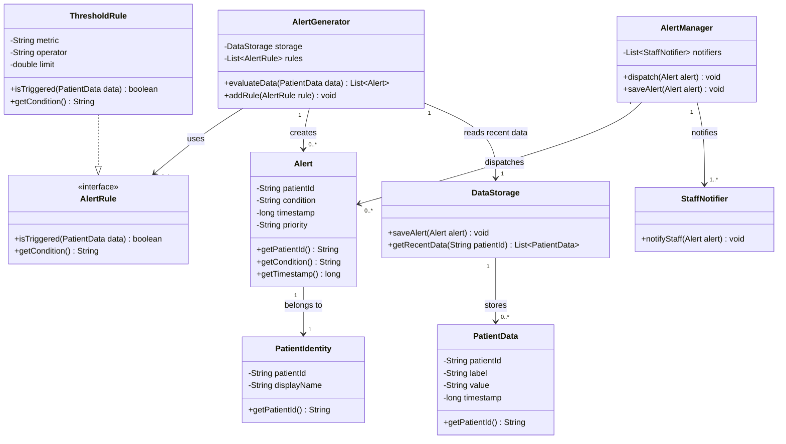
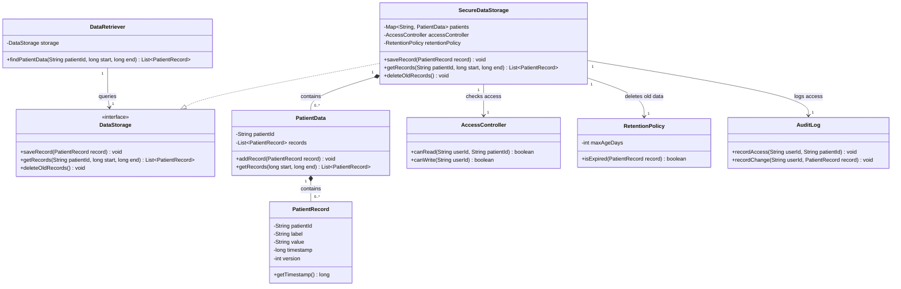
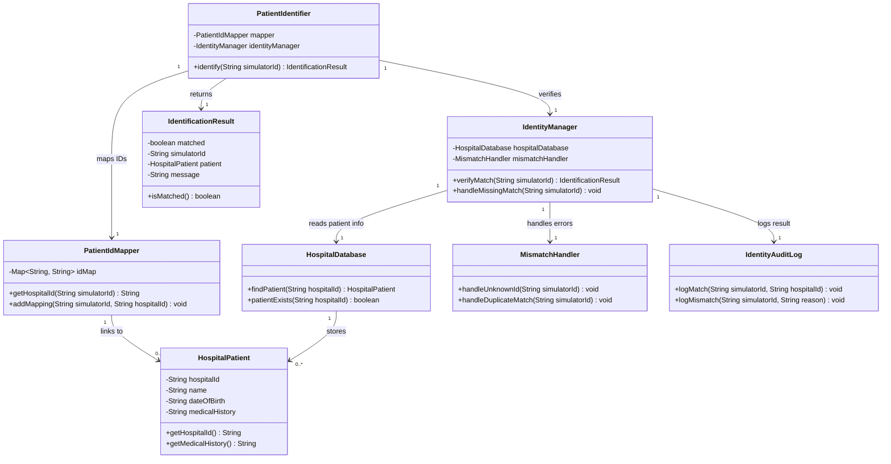
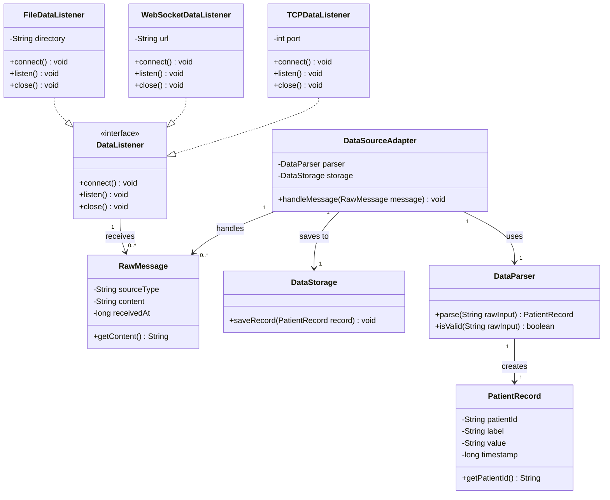

# UML Models

This directory contains the UML class diagrams for the Cardiovascular Health Monitoring System
(CHMS). The diagrams are written in Mermaid, so they can be viewed directly on GitHub or copied
into a UML tool for exporting to PNG or PDF.

## Alert Generation System

This diagram shows how alerts are created and sent to staff. `AlertGenerator` checks incoming
patient data and decides if an alert should be made. It uses `AlertRule` objects for this, because
different patients can have different limits. For example, one patient can have a different heart
rate threshold than another patient. `ThresholdRule` is used as a simple rule that compares a
measurement with a limit.

When an alert is needed, the generator creates an `Alert`. The alert contains the patient ID, the
condition, the timestamp, and a priority. The `AlertManager` is responsible for sending the alert to
staff. This makes the design clearer, because the generator only checks the data and the manager
handles the dispatching. `StaffNotifier` represents the part that actually notifies staff.

The model also links alerts to patient identity and data storage. `DataStorage` can provide recent
patient data, which is useful when an alert depends on more than one measurement. The patient
identity is kept separate, so not every class needs direct access to personal patient information.
This helps with privacy and keeps the responsibilities more clear. The multiplicities show that one
generator can use multiple rules and that multiple alerts can be created over time.
This matches the requirement that alerts are checked in real time.

## Data Storage System

This diagram shows how patient measurements are stored and retrieved. `DataStorage` is made as an
interface, so the rest of the system does not need to know the exact storage implementation.
`SecureDataStorage` is the main class that stores the data. It contains multiple `PatientData`
objects, and each `PatientData` object contains multiple `PatientRecord` objects. This fits the
system because each patient can have many measurements over time.

`PatientRecord` stores one measurement. It has the patient ID, label, value, timestamp, and version.
The timestamp is important because medical staff may want to retrieve records from a specific time
period. The version can help when records are updated or checked later. `DataRetriever` is used to
request records from storage, instead of letting every class search the storage directly.

Security is also included in this model. `AccessController` checks if a user is allowed to read or
write patient data. `RetentionPolicy` decides when older records should be deleted, which is useful
for privacy and storage limits. `AuditLog` records when data is accessed or changed. This makes the
system easier to check later if something goes wrong. Overall, the storage classes are mainly
responsible for saving data, while other classes handle access, retrieval, and cleanup.
This keeps the design simple.

## Patient Identification System

This diagram shows how simulator patient IDs are matched to hospital patient records. This is
important because the data from the simulator only has value if it is linked to the correct patient.
`PatientIdentifier` is the class that starts the matching process. It receives a simulator ID and
uses `PatientIdMapper` to find the hospital ID that belongs to it.

After the ID is mapped, `IdentityManager` checks the result with `HospitalDatabase`. This database
contains `HospitalPatient` objects, which include patient details like name, date of birth, and
medical history. This information is sensitive, so the design keeps it inside the identification
part of the system as much as possible. Other parts of the system can mostly work with patient IDs
instead of full patient details.

The `IdentificationResult` class is used to return the result of the match. It can show if the
match was successful and can also include a message if something went wrong. If there is no match,
or if there is a strange situation like a duplicate match, `MismatchHandler` handles it.
`IdentityAuditLog` records matches and mismatches. This is useful because patient matching should
be traceable. If the wrong patient is matched, it could cause serious problems, so the model keeps
this responsibility in one clear subsystem.

## Data Access Layer

This diagram shows how data enters the CHMS from outside the system. The signal generator can send
data through TCP, WebSocket, or files. Because these sources work differently, the model uses a
`DataListener` interface. `TCPDataListener`, `WebSocketDataListener`, and `FileDataListener` all use
the same main methods: connect, listen, and close. This means the rest of the system does not need
to care where the data came from.

When data is received, it is first stored as a `RawMessage`. This represents the original input
before it is cleaned or converted. `DataParser` checks the raw input and turns it into a
`PatientRecord`. This is useful because the input format could be different depending on the data
source. For example, file input might look different from WebSocket input.

`DataSourceAdapter` connects this layer to storage. It receives a raw message, uses the parser, and
then saves the created `PatientRecord` in `DataStorage`. This keeps the data access layer separate
from the storage and alert systems. If a new input source is added later, only a new listener class
is needed. The parser and adapter can still be reused. This makes the model easier to maintain and
also easier to test.
This matches the requirement to keep input handling separate from the system.
